```{r setup, include=FALSE}
options(htmltools.dir.version = FALSE)
knitr::opts_chunk$set(echo = TRUE)
```

```{r echo=F, message=F, warning = F}
require(xaringanExtra) 
require(stargazer)
require(tidyverse)
require(knitr)
require(kableExtra)
require(DT)
```

```{r xaringan-logo, echo=FALSE}
xaringanExtra::use_logo("NU2.png")
```

```{r xaringan-tile-view, echo=FALSE}
xaringanExtra::use_tile_view()
# Below generates a new class of simulation table, as otherwise it will not fit.
```

```{css, echo = F}
table {
  font-size: 16px;     
}
```

```{css, echo = F}
.table_small table {
  font-size: 5.9px;     
}
```

```{css, echo = F}
.table_red table {
  font-size: 10px;     
}
```

## Welcome!

* Northumbria University

--

* Newcastle

```{r, out.width = "300px", echo=FALSE, fig.align='center'}
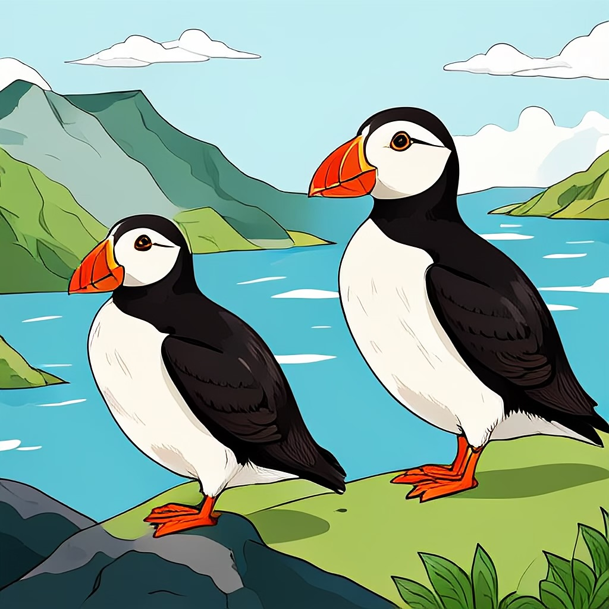
```

???
We adopted the Puffin as the mascotte for this EHBEA. And if you manage to extend your trip we recommend the Northumberland coast (Farne islands)

---
## Thanks to the team.


```{r, out.width = "600px", echo=FALSE, fig.align='center'}
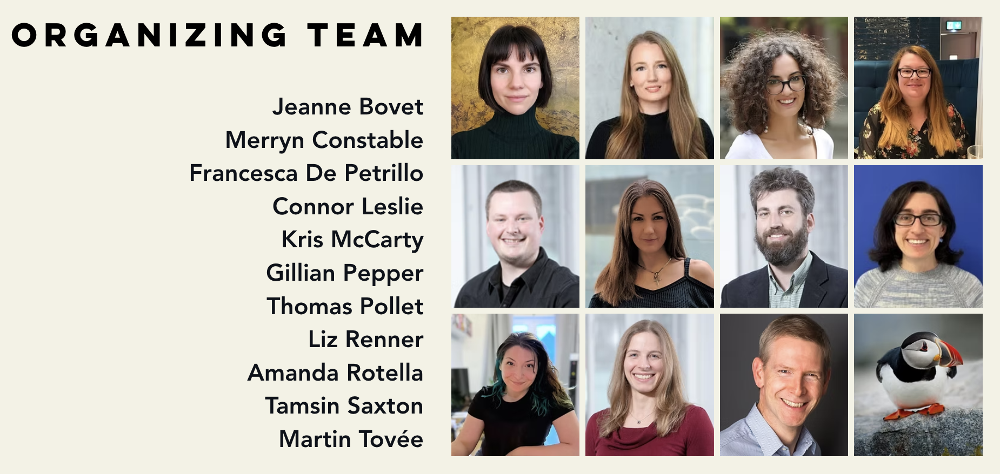
```

*  Plus: On the day staff / student volunteers from Northumbria and Newcastle.

---
## Thanks to our sponsors.

```{r, out.width = "700px", echo=FALSE, fig.align='center'}
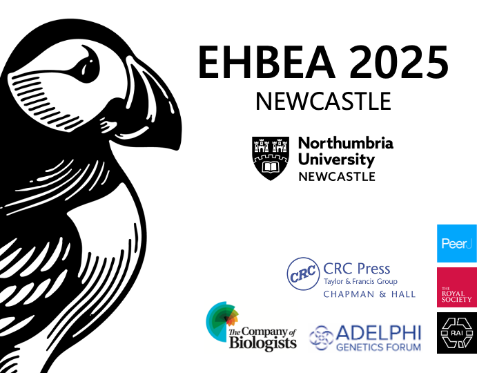
```

---
## Company of biologists

```{r, out.width = "700px", echo=FALSE, fig.align='center'}
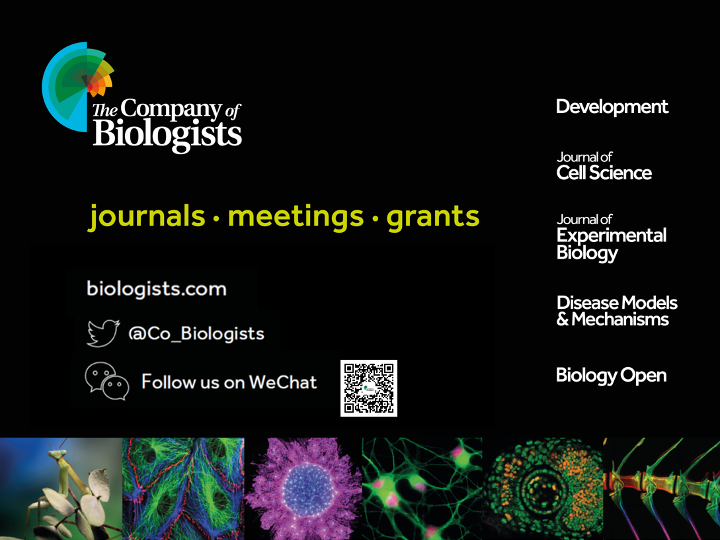
```

---
## Usual admin.: Fire Safety

* No drills planned

* Leave belongings - Find nearest exit and follow the signage. Follow advice from staff and fire marshall.

* Do not re-enter until told to do so.

```{r, out.width = "300px", echo=FALSE, fig.align='center'}
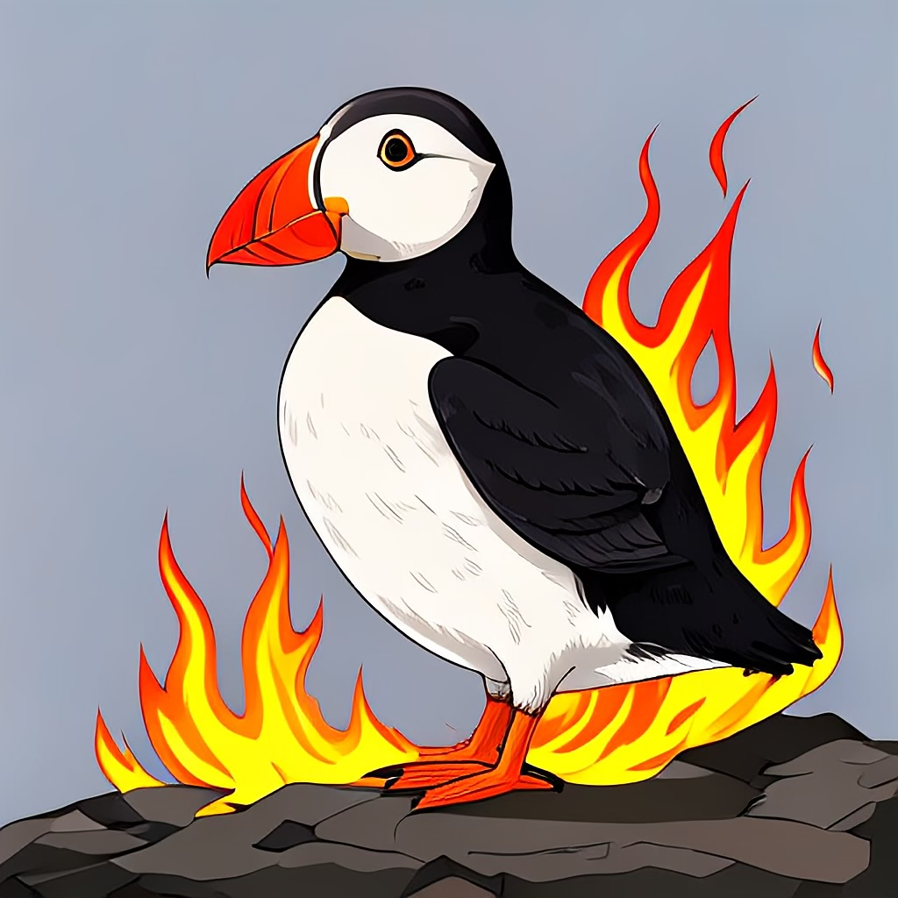
```

---
## Conference assistance

* Yellow badges

```{r, out.width = "300px", echo=FALSE, fig.align='center'}
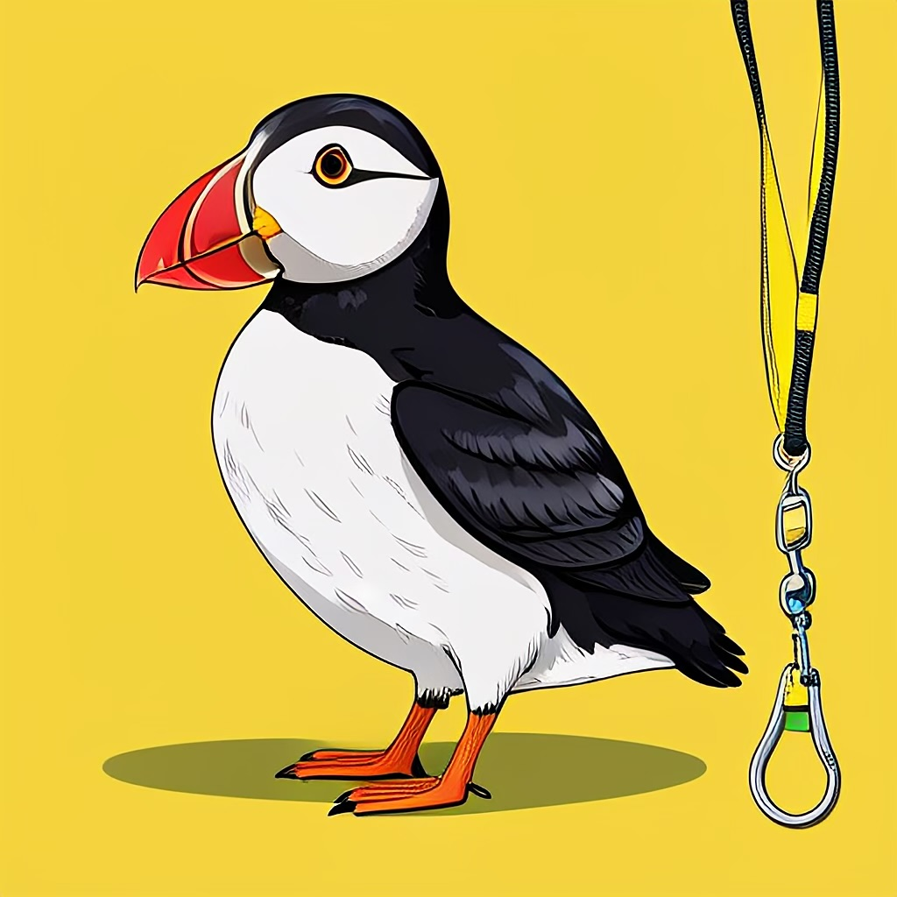
```

--

* Registration desk (during breaks)

--

* [ehbea2025@northumbria.ac.uk](ehbea2025@northumbria.ac.uk) / [@ehbea2025.bsky.social](@ehbea2025.bsky.social)

--

* Code of Conduct - Amanda Rotella, Paula Sheppard, David Coall (or approach desk and we will put you in touch)

---
## Your badge...

* Useful info: have a read.

--

* Cat sticker: for ECR / first time mixer

--

* Dinner ticket (golden sticker - additional based on your dietary preferences). --> still some available contact the registration desk.

```{r, out.width = "300px", echo=FALSE, fig.align='center'}
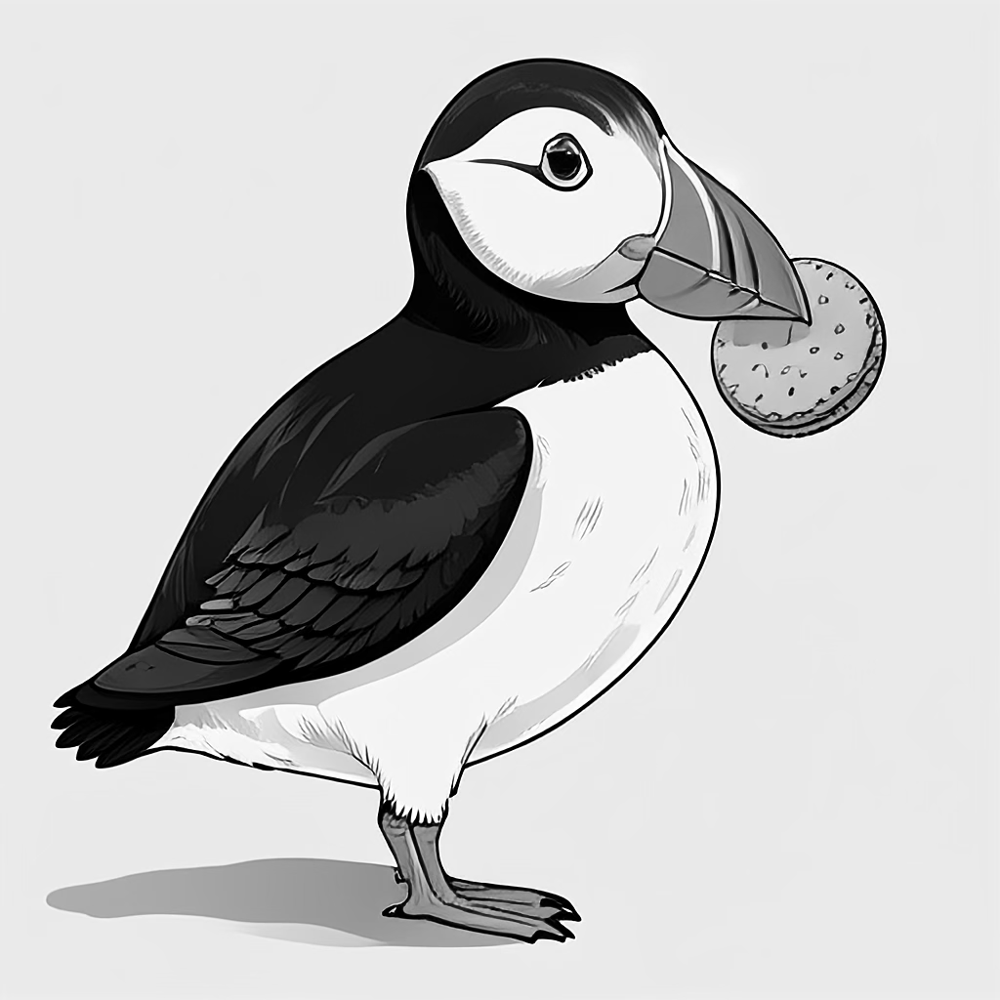
```

---
## Poster session

* Poster boards go up tomorrow morning and will stay up until final break on last day (Thursday 3.30pm). 

--

* Find the number corresponding to the poster list (_not your abstract ID_)

--

* Make sure to vote for best student poster. **Voting closes at 3 pm on Friday**

```{r, out.width = "300px", echo=FALSE, fig.align='center'}
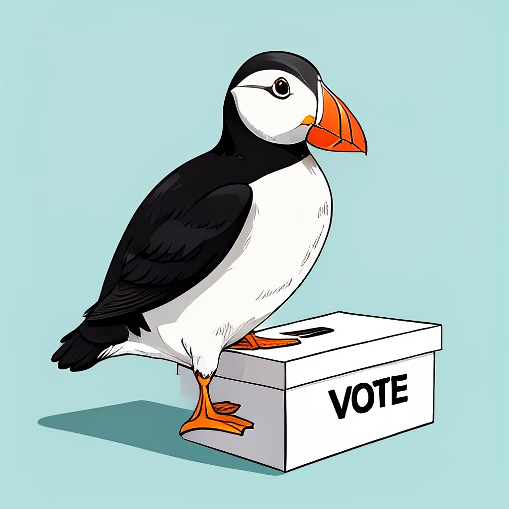
```

---
## Talks

* **Please stick to time**. Regular talk: 15 + 5 mins. Short talk 7 + 3 mins. --> if you go over no questions.

--

* Prefer if you present from desktop. If you intend to present from own device let chair know and check with conference volunteer during break.

--

* Check your talk is uploaded on conference desktop in the room you are presenting in. (Transfer possible via USB stick)

--

* Double check if you are chairing a session. (Time keeping, introducing speakers and liaise with speakers regarding questions)

```{r, out.width = "250px", echo=FALSE, fig.align='center'}
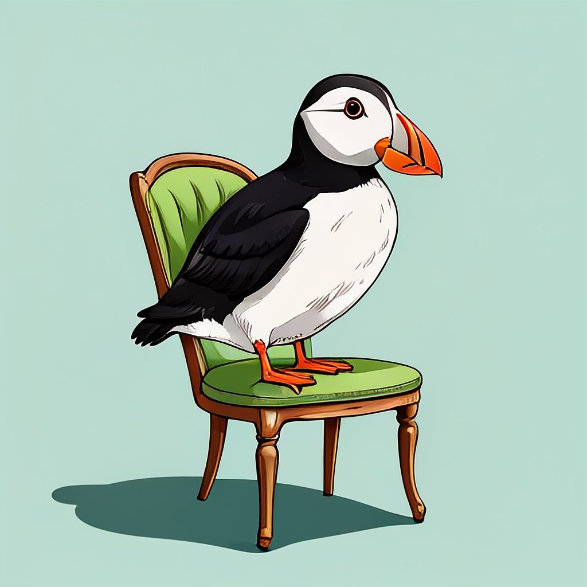
```

---
## Programme: Publishing workshop (Cambridge University Press)

* Wednesday 1pm in CCE-003 (smaller lecture theatre)

* Evolutionary Human Sciences

* Editors will be at this session

```{r, out.width = "250px", echo=FALSE, fig.align='center'}
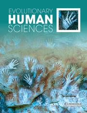
```

---
## Programme: Stand up for Science panel

* Wednesday 5.10 pm in this room, led by our President, Rebecca Sear.

* Panel members: Louis Bachaud, David Coall, Reuben Fakoya-Brooks, Ula Marcinkowska, Abbey Page, Rebecca Sear

```{r, out.width = "300px", echo=FALSE, fig.align='center'}
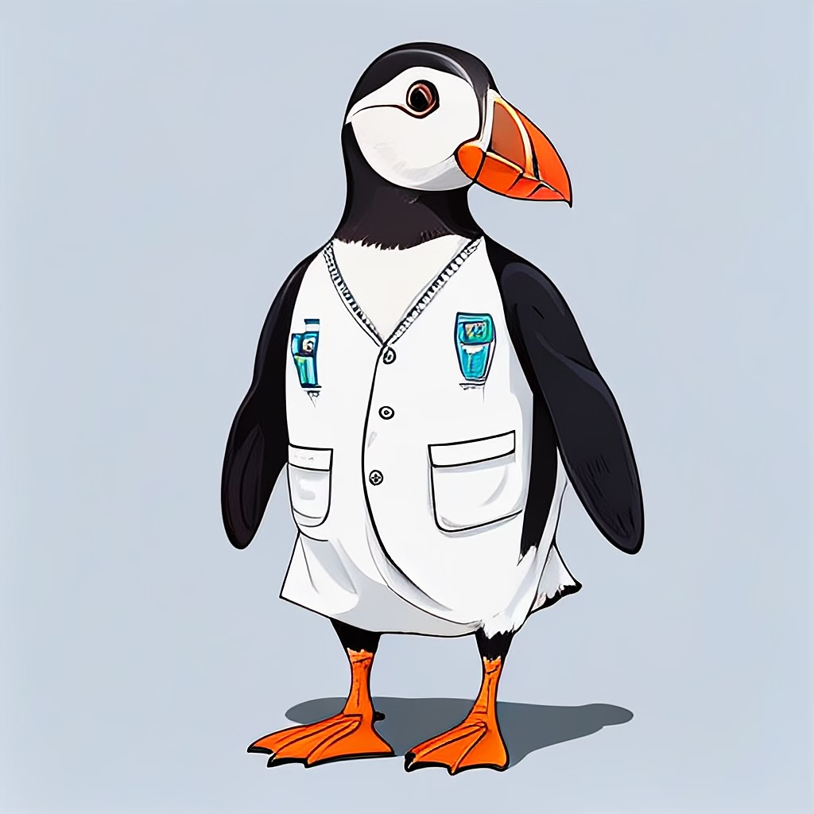
```

---
## Programme: Social

* Wednesday from 6.30pm : Donzoko Brewery & Taproom in Ouseburn (~11 min walk from venue - check map incl. with badge). 

* Feel free to bring food (Gingerino’s pizzeria is right next door!).

```{r, out.width = "400px", echo=FALSE, fig.align='center'}
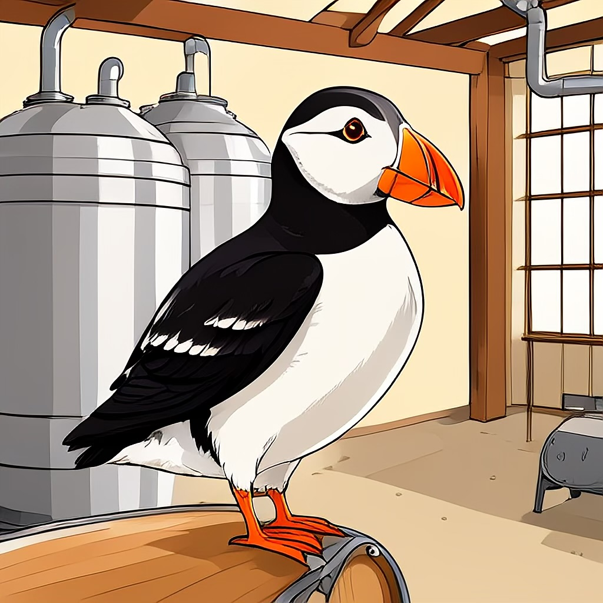
```


---
## Programme: Plenaries

* Always in this room.

```{r, out.width = "800px", echo=FALSE, fig.align='center'}
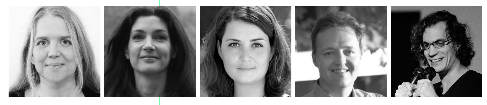
```

---
## Over to the first plenary


